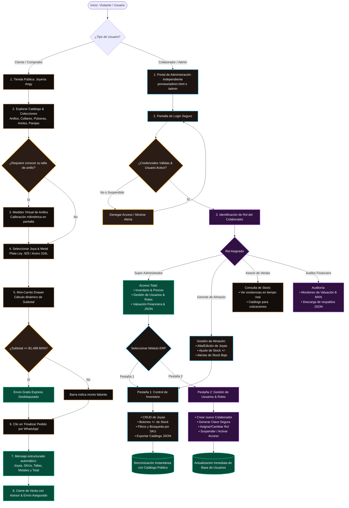
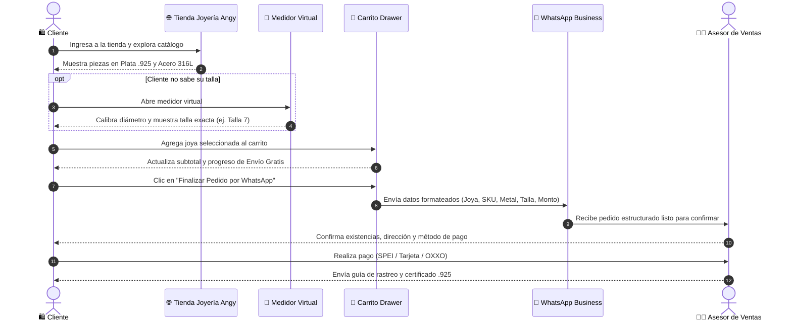
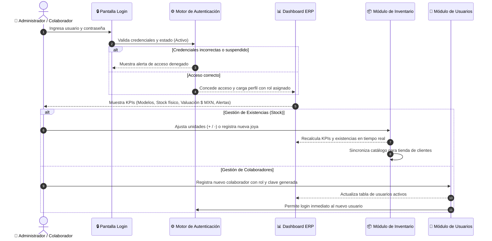
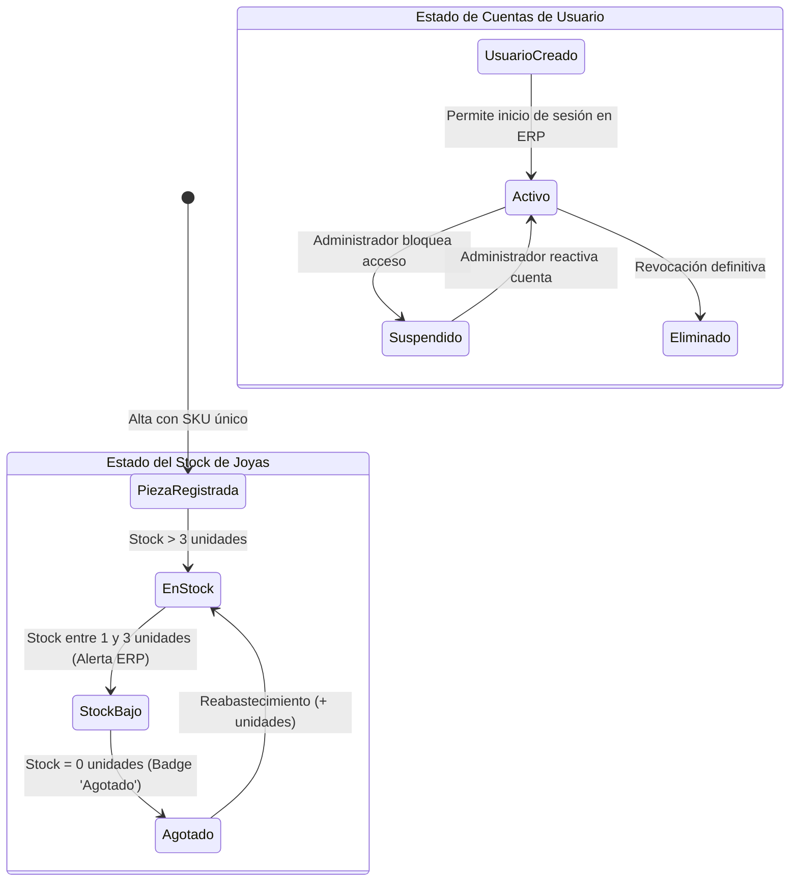

# 📊 Diagrama de Procesos del Proyecto: Joyería Angy

Este documento describe la arquitectura de flujos y procesos de la solución digital de **Joyería Angy**, desarrollada por **Gaona Consultores TI**, cubriendo tanto la experiencia de compra del cliente en la tienda pública como la operativa interna en el portal ERP administrativo.

---

## 1. Diagrama de Flujo Global del Sistema

---

## 2. Diagrama de Secuencia: Experiencia de Compra por WhatsApp

---

## 3. Diagrama de Secuencia: Gestión Operativa en el Portal ERP

---

## 4. Matriz de Entidades y Estados

